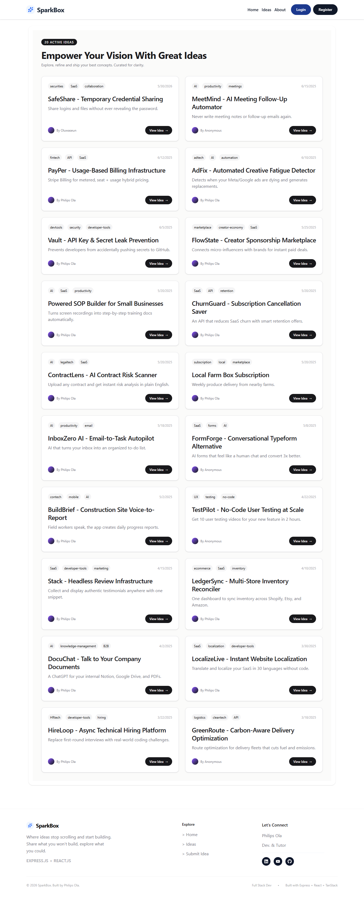
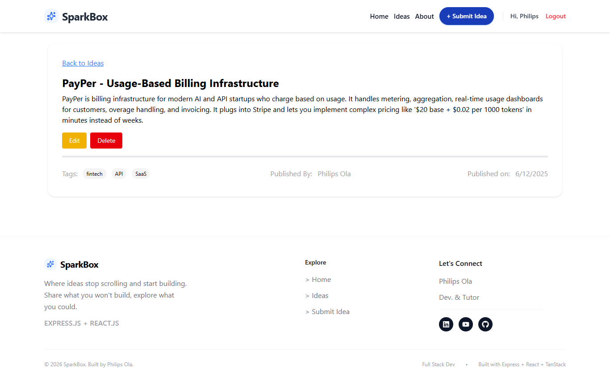
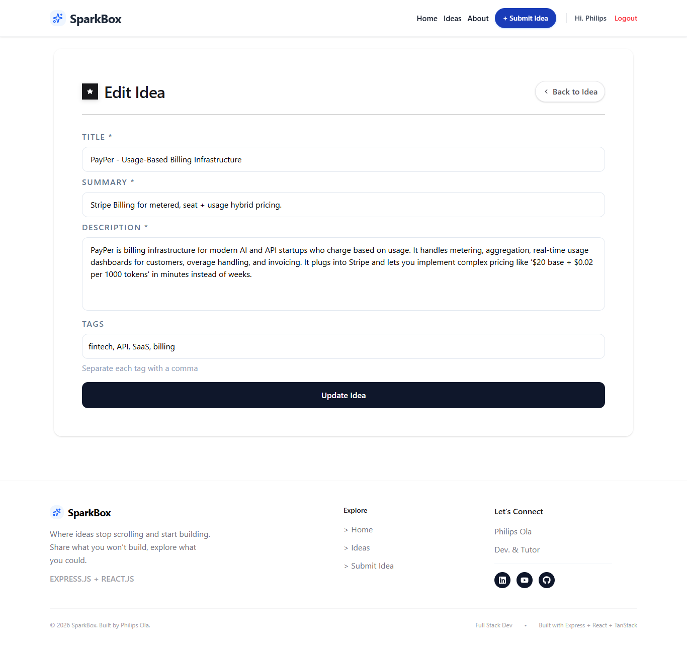
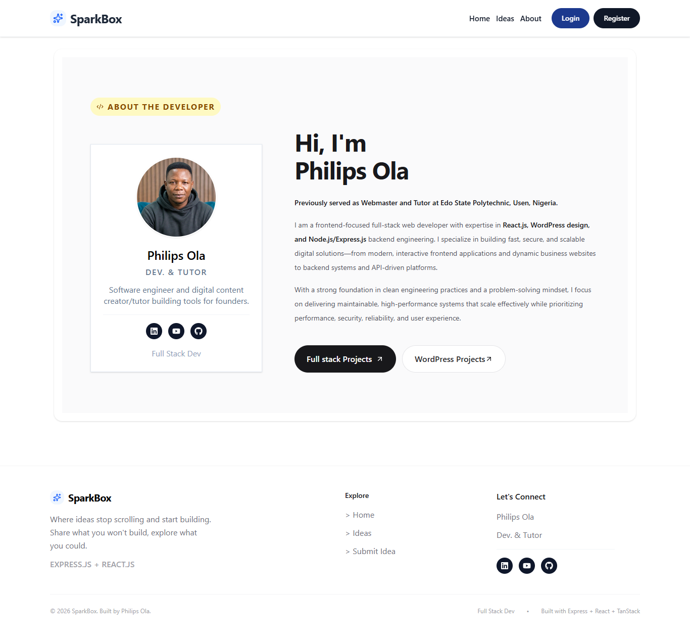

# About the Project

Spark Box is a REST API for a community idea-sharing app. It lets developers and technology enthusiasts publish ideas, browse submissions, and manage their own posts. The API provides account registration and login, JWT-based authentication, and MongoDB persistence.

This repository contains the Express.js backend. The live demo and GitHub link below point to the companion user interface; a separately hosted API URL was not provided. The API can be run locally by following the setup steps below.

Live demo: https://spark-boxs.vercel.app/

Companion UI repository: https://github.com/philips-ola/spark-box-ui

## Project Overview

- Demonstrates building a REST API with Express and Node.js.
- Uses MongoDB and Mongoose to store users and ideas.
- Provides account registration, login, logout, and access-token refresh routes.
- Protects idea creation, editing, and deletion with bearer access tokens.
- Associates ideas with their authors and checks ownership before edits or deletion.
- Includes request parsing, CORS configuration, centralized error responses, and Node.js tests.

## Why This Project Is Useful for Study

- **REST API design:** practice mapping resources to HTTP methods and status codes.
- **Middleware:** see how authentication and error handling fit into an Express request pipeline.
- **JWT authentication:** learn access-token verification and refresh-token cookies.
- **Database modeling:** explore Mongoose schemas, references, timestamps, and queries.
- **Password security:** inspect password hashing and comparison with `bcryptjs`.
- **Authorization:** distinguish an authenticated user from the owner of a particular idea.
- **Validation:** follow checks for required fields, duplicate titles, and MongoDB IDs.
- **API-driven UI integration:** connect a frontend to JSON endpoints and handle loading, success, and error responses.

## Features

### 1. Account and Token Management
Users can register and log in to receive an access token. A refresh token is stored in an HTTP-only cookie for requesting a replacement access token.

- Passwords are hashed before being stored.
- Access tokens expire after one minute; refresh tokens expire after 30 days.
- Logout clears the refresh-token cookie.

### 2. Browse Ideas
Visitors can retrieve the latest ideas or request a single idea by its MongoDB ID. List results include the author's name and are ordered newest first.

- Optionally limit list results with the `_limit` query parameter.
- Read endpoints are public.

### 3. Create and Manage Ideas
Authenticated users can create ideas and update or delete ideas they own. Each idea can include a title, summary, description, and tags.

- Idea creation requires a valid bearer access token.
- Update and delete operations enforce idea ownership.
- Tags can be sent as an array or as comma-separated text when creating or updating.

## Screenshots

These screenshots are from the companion frontend.

### Landing Page


### All Idea Page


### Detail Page


### Edit Idea Page


### Add Idea Page


### Login Page


### Registration Page


### About Me



## Tech Stack

- **Node.js** with ES modules
- **Express 5** for HTTP routes and middleware
- **MongoDB** with **Mongoose** for data persistence
- **jose** for signing and verifying JWTs
- **bcryptjs** for password hashing
- **cookie-parser** for refresh-token cookies
- **cors** for cross-origin requests
- **dotenv** for environment configuration
- **Node.js built-in test runner** for automated tests

## Project Structure

```text
Spark-Box-API/
├── config/
│   └── db.js
├── data-import/
│   └── ideas.json
├── middleware/
│   ├── authMiddleware.js
│   └── errorHandler.js
├── models/
│   ├── Idea.js
│   └── User.js
├── routes/
│   ├── authRoutes.js
│   └── ideaRoutes.js
├── tests/
│   └── app-fixes.test.js
├── utils/
│   ├── generateToken.js
│   └── getJwtSecret.js
├── .env                         # Create locally; do not commit secrets
├── LICENSE
├── package.json
├── package-lock.json
├── README.md
└── server.js
```

## How the App Works

### App Startup
`server.js` loads environment configuration, connects to MongoDB, configures JSON and cookie parsing plus credentialed CORS, then mounts the routers under `/api/ideas` and `/api/auth`. The API listens on port `8000` by default, or the port set in `PORT`.

### Global Data Fetch
The backend does not fetch data for a frontend screen. Instead, the companion UI sends HTTP requests to this API. Idea list and detail requests query MongoDB through Mongoose; list requests sort by creation date and populate the author's name.

### Component Responsibilities
This repository is a backend and does not contain React components. `routes/` handles HTTP endpoints, `middleware/` handles authentication and errors, `models/` defines MongoDB documents, `config/db.js` connects to MongoDB, and `utils/` creates JWTs and loads the signing secret.

### Auth Flow
Registration or login returns a short-lived access token in the JSON response and sets a refresh token in an HTTP-only cookie. The UI sends the access token as `Authorization: Bearer <token>` to protected idea routes. When the access token expires, the UI can call `/api/auth/refresh` with credentials so the browser sends the refresh cookie; a valid refresh token returns a new access token.

## API Usage

Set `API_BASE_URL` to the deployed API origin when one is available. For local development, use `http://localhost:8000`.

### Authentication

Register a user; required fields are `name`, `email`, and `password` (at least six characters):

```http
POST /api/auth/register
Content-Type: application/json

{"name":"Alex Developer","email":"alex@example.com","password":"example-password"}
```

Log in with email and password. The response includes an access token; the refresh token is set as an HTTP-only cookie:

```http
POST /api/auth/login
Content-Type: application/json

{"email":"alex@example.com","password":"example-password"}
```

Request a new access token. Send the refresh cookie, typically by enabling credentials in the HTTP client:

```http
POST /api/auth/refresh
Cookie: refreshToken=<refresh-token>
```

Clear the refresh-token cookie:

```http
POST /api/auth/logout
```

### Ideas

List ideas, optionally limiting the number returned:

```http
GET /api/ideas
GET /api/ideas?_limit=10
```

Retrieve one idea by its MongoDB ID:

```http
GET /api/ideas/<idea-id>
```

Create an idea. Send a valid access token in the `Authorization` header:

```http
POST /api/ideas
Authorization: Bearer <access-token>
Content-Type: application/json

{"title":"A useful idea","summary":"A short summary","description":"More detail about the idea.","tags":["learning","web"]}
```

Update an idea you own. The current route requires `title`, `summary`, and `description` in the request body:

```http
PATCH /api/ideas/<idea-id>
Authorization: Bearer <access-token>
Content-Type: application/json

{"title":"An updated idea","summary":"Updated summary","description":"Updated details.","tags":["web"]}
```

Delete an idea you own:

```http
DELETE /api/ideas/<idea-id>
Authorization: Bearer <access-token>
```

## Running the Project Locally

### 1. Install
Install Node.js, create a MongoDB database, and install the project dependencies:

```bash
npm install
```

Create a `.env` file using the example in the next section, and set `MONGODB_URI` and `JWT_SECRET`.

### 2. Start dev server
Start the API with Node's watch mode. By default it listens on `http://localhost:8000`:

```bash
npm run dev
```

### 3. Build
This project runs directly on Node.js and has no compile or bundle step. Run the available automated tests:

```bash
npm test
```

### 4. Preview
With the API running and MongoDB connected, request the public ideas endpoint:

```bash
curl http://localhost:8000/api/ideas
```

## Environment Variables

Create a `.env` file in the project root:

```dotenv
PORT=8000
MONGODB_URI=mongodb://127.0.0.1:27017/spark-box
JWT_SECRET=replace-this-with-a-long-random-secret
NODE_ENV=development
```

- `MONGODB_URI` is required to connect to MongoDB.
- `JWT_SECRET` should be a long, random secret and must be set in deployed environments. The source contains a development fallback, which is not suitable for production.
- `PORT` is optional; the default is `8000`.
- `NODE_ENV` controls production cookie settings and whether error responses include stack traces.

## Notes for Study

- Trace a request from the mounted route in `server.js` through its route handler and middleware.
- Compare authentication (a valid token) with authorization (ownership of the requested idea).
- Inspect how the API maps validation failures, missing resources, and ownership failures to HTTP status codes.
- Test protected routes with missing, malformed, expired, and valid access tokens.
- Connect the companion frontend by configuring its API origin and enabling credentials for refresh-cookie requests.

## License

This project is for educational and portfolio use.

## Developer Detail

- **Name:** Philips Ola
- **Role:** Full-Stack Developer
- **Portfolio:** https://olaphilips.com.ng
- **YouTube:** https://youtube.com/@idtechnol
- **LinkedIn:** https://linkedin.com/in/olaphilips/

## Summary

Spark Box API is a compact study project for learning how an Express service can combine MongoDB persistence, JWT authentication, and ownership-aware CRUD operations. Use it as a foundation for exploring secure API design and integrating a backend with a separate frontend.
